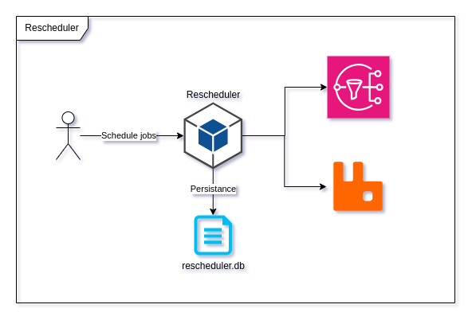

# Rescheduler-lite  [](https://sonarcloud.io/dashboard?id=mkromkamp_rescheduler-lite) [](https://codecov.io/gh/mkromkamp/rescheduler-lite) 

Rescheduler-lite is a job/work scheduler that is easy to deploy, operate, and worker/environment agnostic

# Project status

Rescheduler-lite is in development and thus all warnings apply; feel free to play around, raise PRs, get involved in discussion, but above all else don't rely on it for now(!) 🙂

# Features

- Single binary
- Low memory footprint
- Built-in observability
- Build-in backup and restore
- Build on top of standard components
- Leverage [RabbitMQ](https://www.rabbitmq.com), [Azure Service Bus](https://azure.microsoft.com/services/service-bus/), or [Aws SNS](https://aws.amazon.com/sns) for message passing

# Goals

The main goal of rescheduler-lite is to simplify scheduled/recurring jobs for small and mid-size projects. 

More often than not a basic feature needs to be implemented that requires *things* to happen in the future (sending reminder emails, webhooks, etc.) or to perform a recurring task (generating reports, collecting external information, etc..). 

Where these *things* are usually really project specific the scheduling of these jobs is not. Still it can be a hassle to get job scheduling setup in a convenient and low maintenance fashion.

rescheduler-lite aims to take away this generic scheduling of jobs while not having any opinions around the way these jobs are implemented or executed. All of this while being easy to deploy and maintain for smaller teams.

# High level architecture

Rescheduler-lite is a self-contained application that doesn't require dedicated services, outside of an RabbitMQ node, Azure Service bus queue, or Aws SNS topic, to run. The binary can be ran on any machine with a supported cpu architecture as long as it has read and write access to the database file.

For recommended hardware specifications refer to the [Deployment](#deployment) section. The diagram below should give a basic understanding of how rescheduler-lite functions on a high level.



# API

All interaction with rescheduler-lite is done through its API.

API docs can be accessed on `/api/docs`, when running the docker-compose http://localhost:8080/api/docs

# Deployment

Rescheduler-lite consists of a single binary that can be deployed virtually everywhere. The only constraint is the availability of some form of persistent storage.

Alongside rescheduler-lite it is needed to deploy a messaging technology. Currently RabbitMQ, Azure Service Bus, and AWS SNS are supported. These messaging techonologies are needed to pass messages from rescheduler-lite to consumers.

## Binary

Describe binary deployment

## Docker

Describe docker based deployment

# Contributing

Contributions are welcome 👍

## Discussions and Questions

For all discussions and questions there is a separate [discussions board](https://github.com/mkromkamp/rescheduler-lite/discussions). For everything that is not a bug report please use this board.

## Issues

When you are testing rescheduler-lite and run into something you think is an issue it would be appreciated if you take the time to describe the issue you run into with as much context as possible. You can drop this information in the [issues section](https://github.com/mkromkamp/rescheduler-lite/issues) and apply the *bug* tag.

## Documentation

If you feel like there is missing or incorrect documentation feel free to create an [issue](https://github.com/mkromkamp/rescheduler-lite/issues) with the corresponding *documentation* tag. Please take your time to describe what and why you are missing, of coarse you are free to come up with an initial write-up or proposal of how to document this part of the application.

## Development

In order to start ~hacking~ developing on rescheduler-lite the following is needed

- [.NET 6 SDK](https://dotnet.microsoft.com/download/dotnet/6.0)
- [favorite IDE, VScode is free and easy to get started with](https://code.visualstudio.com/)
- [Docker](https://docs.docker.com/get-docker/)
- [Docker compose](https://docs.docker.com/compose/install/)

After that you should be able to start developing on the project and run any development dependencies (RabbitMQ) in Docker

### Docker

In order to start RabbitMQ you can use the docker-compose file in the repo.

From the root of the project run;
``` bash
docker-compose up -d --build
```

# Monitoring

Rescheduler-lite is shipped with build in logs in JSON format and metrics in OpenMetrics format

## Logs

By default logs will be directed to stdout and stderr from there you can forward/ingest they into your log collector.

## Metrics

Metrics are provided and OpenMetrics format and exposed on the `/metrics` path. The following types of metrics exposed

- Node/host metrics, prefixed with `node_`
- Dotnet CLR metrics, prefixed with `dotnet_`
- Http metrics, prefixed with `http_`
- Application metrics, prefixed with `sched_`
 
